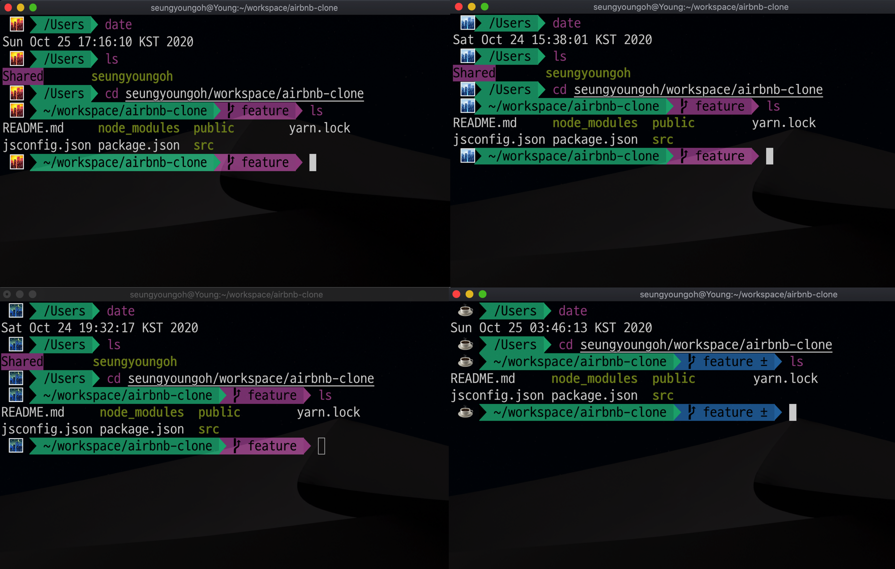

# my bash setting

Document to save my bash settings. It covers zsh, iTerm2, vim settings.

I'm using Mac OS, catalina.

details

* agnoster(zsh), dracular(vim) 
* I manually set up the color of the terminal and looks good to me.

* I set the agnoster prefix emoji to change by time

